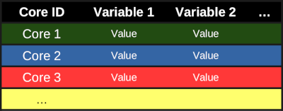

[](https://zenodo.org/badge/latestdoi/336005552)

# BlueCarbon

The BlueCarbon package is a collection of functions with the main focus to help "blue carbon" scientists

<<<<<<< HEAD


## Setup
=======
>>>>>>> upstream/main
The following packages need to be installed and loaded:
- *tidyverse*
- *drc*
- *aomisc*

```
library("tidyverse")
library("drc")
install.packages("remotes") # only the first time
remotes::install_github("OnofriAndreaPG/aomisc") # only the first time
library(aomisc)
```

<<<<<<< HEAD
## Data format expected
TODO: Add information about expected variables, how they should be measured, etc.

To use the functions collected here, you need 2 main datasets:
1. Sediment core properties
2. Sediment sample properties

The data is expected to follow [tidy data format](https://cran.r-project.org/web/packages/tidyr/vignettes/tidy-data.html), with one observation per row and one variable per column.

Here is a visual representation of what that would look like:

**Table of cores**



**Table of samples**


Notice how the column used to identify the sediment cores is present in both tables. This is important, as it a key to identify the core from which a sample originated from.

## Suggested changes to names:


1. tube_length ==> sampler_length
2. core_in ==> internal_distance
3. core_out ==> external_distance


## Suggested changes to functions:

I think it might be easier to break down the package into more functions, which would work in order, as such:
1. `bc_comp`- basically keep it as is, just change so that user provides a data.frame and columns for compaction rate and compaction correction rates are added. These columns are then used in function 2.
2. Break down `bc_decomp`in 2 functions:  

	2.1 Correct sample depth and sample volume to account for compaction (linear and exponential methods). Currently done in `bc_decomp`
		- User provides the core data.frame from `1` and another data.frame with the sample data. User can specify if the sample volume is estimated from a half of the core or if the sample volume was measured in another way.

	2.2 Estimate carbon content from LOI, using pre-measured values. Currently done in `bc_decomp`
		- User can provide some measurements of carbon content and organic matter. The OC content of samples where OC was NOT measured is then added (when OC was measured, that value is maintained). Also allows the user to provide more data that just the one being analyzed (if you are analyzing cores from one area but have more samples with measured OC contents and wnat to use them in your model)

	2.3 Add dry bulk density and carbon concentation (g cm3)

## Contents

At the moment, the following functions are presented:
1.  *bc_comp*
2.  *bc_decomp*
3.  *bc_stock* (work in progress)

### 1. *bc_comp*
=======
The following functions are presented:
1.  *bc_comp*
2.  *bc_decomp*
3.  *bc_stock* (work in progress)
4.  ...        
           
          
## 1. *bc_comp*
>>>>>>> upstream/main

*bc_comp* calculates the **Percentage of core compression** and the **Linear Correction Factor** using three arguments 

`bc_comp(tube_lenght, core_in, core_out)`

#### Arguments

- `tube_length` lenght in cm of the sampler,
- `core_in` lenght in cm of the part of the sampler left outside of the sediment (from the inside of the sampler),
- `core_out`lenght in cm of the part of the sampler left outside of the sediment (from the outside of the sampler)

#### Output

**Percentage of core compression**, percentage of compression in the core      
**Linear Correction Factor**, estimate the linear correction factor that can be applied assuming the same compression through all the core

### 2. *bc_decomp*

*bc_decomp* uses six arguments  

`bc_decomp(data, tube_lenght, core_in, core_out, diameter, method = "linear)`

#### Arguments

- `data` dataframe with the following columns "ID"	"cm"	"weight"	"LOI"	"c_org"

- `tube_length` lenght in cm of the sampler,
- `core_in` lenght in cm of the part of the sampler left outside of the sediment (from the inside of the sampler),
- `core_out`lenght in cm of the part of the sampler left outside of the sediment (from the outside of the sampler),
- `diameter` in cm of the sampler
- `method` used to estimate the decompressed depth of each section, "linear" or "exp". Default is "linear"

#### Output

The output is a dataframe that use the same "ID" of the data provided. For each row, the following information are calculated: 

`cm_deco`, decompressed depth of each section expressed in cm    
`sect_h`, height of each section expressed in cm     
`volume`, volume of each section expressed in cm<sup>3</sup>   
`density`, density of each section expressed in g/cm<sup>3</sup>     
`c_org_est`, estimation of organic carbon concentration based on the linear relationship between LOI and c_org data provided       
`c_org_density`, density of organic carbon concentration expressed in g/cm<sup>3</sup>           
`c_org_dens_sect`, density of organic carbon concentration of each section expressed in g/cm<sup>2</sup>      

### 3. *bc_stock* (work in progress)

*bc_stock* calculates carbon stock 

`bc_stock(data, depth = 1)`

#### Arguments

- `data` dataframe with the following columns "ID", "cm_deco", "c_org_dens_sect"     

- `depth` used to standardize the amount of carbon stored. Default is 1 m

Every suggestions/comments/changes to improve all the codes are welcome :)
