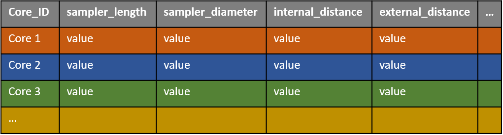
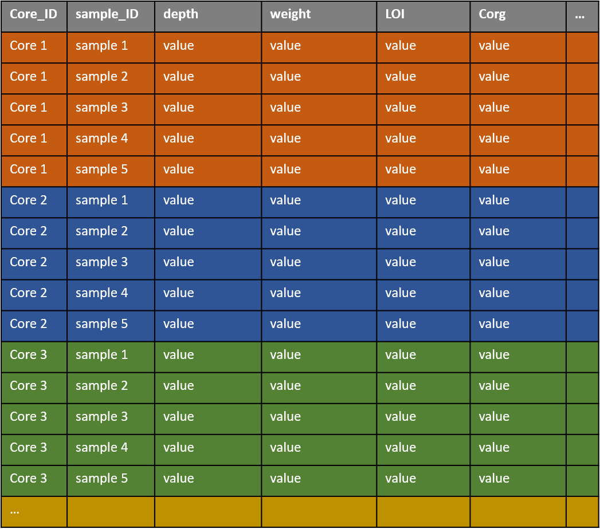

[](https://zenodo.org/badge/latestdoi/336005552) 

# BlueCarbon

The BlueCarbon package is a collection of functions with the main focus to help "blue carbon" scientists

## Installation

The following packages need to be installed and loaded:
- *tidyverse*
- *drc*
- *aomisc*

```
install.packages("tidyverse")
install.packages("drc")

install.packages("devtools") # only the first time
devtools::install_github("OnofriAndreaPG/aomisc")

library("aomisc")
library("tidyverse")
library("drc")
```

Install the BlueCarbon package (and the vignettes):
```
# You can install (and update) the BlueCarbon package from GitHub

devtools::install_github("valybionda/BlueCarbon", build_vignettes = TRUE)
```

## Expected data format

To use the functions collected here, you need to provide 2 datasets:
1. Sediment core properties
2. Sediment sample properties (WORK IN PROGRESS)

The data is expected to follow [tidy data format](https://cran.r-project.org/web/packages/tidyr/vignettes/tidy-data.html), with one observation per row and one variable per column.

**Sediment core properties**



In particular, for each core **Core_ID** the following information need to be provided  
1. sampler_length, total length of the sampler
2. internal_distance, distance between sampler top and core surface
3. external_distance, distance between sampler top and sediment surface


```
**Sediment sample properties**



**Important**: the column used to identify the sediment cores **Core_ID** is present in both data.frame as it a key to identify the core from which a sample is originated.
Sample_ID
Variable_1
Variable_2
```

## Contents

The following functions are presented:
1.  *bc_compaction*
2.  *bc_decomp*
3.  *bc_stock* (work in progress)
4.  ...        
           
          
### 1. *bc_compaction*

The user provides a data.frame and the function calculates **compaction rates** (in percentage) adding a column in the data.frame.       
The function uses four arguments     

`bc_compaction(data, sampler_lenght, internal_distance, external_distance)`

#### Arguments
- `data` data.frame with core properties
          
- `sampler_lenght` name of the column with the length of the sampler,
- `internal_distance` name of the column with the distance between sampler top and core surface,
- `external_distance` name of the column with the distance between sampler top and sediment surface

#### Output

**compaction rates**, percentage of compression in the core      


### 2. *bc_decomp*

```
Suggestions:
Break down in 2 functions:  
1. Correct sample depth and sample volume to account for compaction (linear and exponential methods). Currently done in `bc_decomp`
		- User provides the core data.frame from `1` and another data.frame with the sample data. User can specify if the sample volume is estimated from a half of the core or if the sample volume was measured in another way.
2. Estimate carbon content from LOI, using pre-measured values. Currently done in `bc_decomp`
		- User can provide some measurements of carbon content and organic matter. The OC content of samples where OC was NOT measured is then added (when OC was measured, that value is maintained). Also allows the user to provide more data that just the one being analyzed (if you are analyzing cores from one area but have more samples with measured OC contents and wnat to use them in your model)
2.1 Add dry bulk density and carbon concentation (g cm3)
```

*bc_decomp* uses six arguments  

`bc_decomp(data, tube_lenght, core_in, core_out, diameter, method = "linear)`

#### Arguments

- `data` data.frame with the following columns "ID"	"cm"	"weight"	"LOI"	"c_org"

- `tube_length` length in cm of the sampler,
- `core_in` length in cm of the part of the sampler left outside of the sediment (from the inside of the sampler),
- `core_out`length in cm of the part of the sampler left outside of the sediment (from the outside of the sampler),
- `diameter` in cm of the sampler
- `method` used to estimate the decompressed depth of each section, "linear" or "exp". Default is "linear"

#### Output

The output is a data.frame that use the same "ID" of the data provided. For each row, the following information are calculated: 

`cm_deco`, decompressed depth of each section expressed in cm    
`sect_h`, height of each section expressed in cm     
`volume`, volume of each section expressed in cm<sup>3</sup>   
`density`, density of each section expressed in g/cm<sup>3</sup>     
`c_org_est`, estimation of organic carbon concentration based on the linear relationship between LOI and c_org data provided       
`c_org_density`, density of organic carbon concentration expressed in g/cm<sup>3</sup>           
`c_org_dens_sect`, density of organic carbon concentration of each section expressed in g/cm<sup>2</sup>      

### 3. *bc_stock* (work in progress)

*bc_stock* calculates carbon stock 

`bc_stock(data, depth = 1)`

#### Arguments

- `data` data.frame with the following columns "ID", "cm_deco", "c_org_dens_sect"     

- `depth` used to standardize the amount of carbon stored. Default is 1 m

